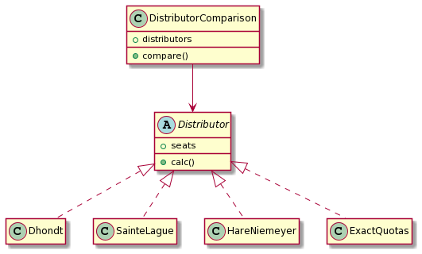

# election-seat-distribution
Basic implementation of election seat allocation methods for proportional representation election systems:

 - [Sainte-Laguë Method (syn. Webster Method)](https://en.wikipedia.org/wiki/Webster/Sainte-Lagu%C3%AB_method)
 - [Hare-Niemeyer Method (syn. Largest remainder method, Hamilton Method)](https://en.wikipedia.org/wiki/Largest_remainder_method)
 - [d'Hondt Method (syn. Jefferson Method, Hagenbach-Bischoff Method)](https://en.wikipedia.org/wiki/D%27Hondt_method)

## Dependencies
Only Python Standard Library. 

## Example
Just run the **example** script.
```
$ python example.py
```

## UML Diagram
